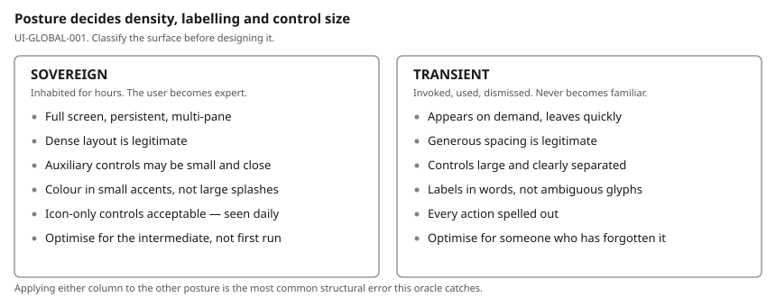
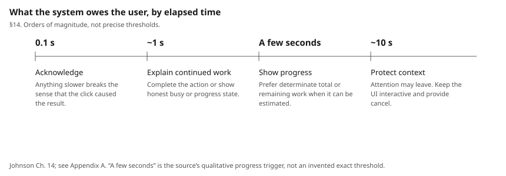

# UI Oracle

## 1. Purpose

A rule set another LLM can apply when designing, implementing or reviewing the
user interface of a Windows desktop OCR/learning tool, and — equally important
— cite. Every rule answers three questions: what to do, who says so, and how to
test it.

This document does **not** design the application. It is the authority the
design is later argued against.

**How to use it.** Given a UI proposal, screenshot or diff: find the rules that
apply, check each against its review test, and report the rule ID, its level,
and whether the finding is a platform requirement, an interaction-design
principle, or a project judgement. If no rule applies, say so — do not invent
one.

**Self-contained by design.** This document does not require the reader to own
the books or open the web pages it names. Everything a rule depends on is
restated in the oracle's own words — in the rule, or in **Appendix A**, which
digests each source. Figures are generated and stored in `img/`; nothing is
hot-linked. Citations are attribution, saying where an idea came from and how
much authority it carries, not a reading list you must complete first.

Short verbatim passages survive in two places only: published numeric
specifications, where paraphrase would destroy the value, and a few
definitions where the exact wording *is* the distinction being drawn.

**Companions.** `UI_ORACLE_CONTRACT.md` (versioning, namespaces, derogations,
adoption), `UI_SOURCE_MATRIX.md` (what was read and what was not),
`UI_CONFLICTS.md` (disagreements and their resolutions), `UI_ANTIPATTERNS.md`,
`UI_REVIEW_CHECKLIST.md`, `modules/*.md` (optional domain rules), and the
adopting project's own `UI_PROFILE.md`.

### Provenance tags

Every rule is tagged. This is the most important convention in the document.

- **SOURCE RULE** — directly supported by a source that was read. The citation
  names it.
- **DERIVED RULE** — reasoned from sources that do not state it outright. The
  reasoning is shown.
- **PROJECT CONVENTION** — a choice recorded in the adopting project's
  `UI_PROFILE.md`. No source claims it; the core carries none of its own.

### Confidence

- **HIGH** — multiple authoritative sources agree, or one states it plainly and
  nothing contradicts it.
- **MEDIUM** — one strong source, or a sound synthesis.
- **LOW** — interpretation. **A LOW-confidence rule is never a MUST.**

### Normative language

MUST / MUST NOT — violation is a defect. SHOULD / SHOULD NOT — violation needs
a recorded reason. MAY — permitted.

---

## 2. Target UI class

A **sovereign-posture desktop application** with **transient-posture
satellites** — a tool inhabited for long sessions by someone who becomes
expert in it, surrounded by surfaces that are invoked, used and dismissed.

Which concrete surfaces are which is declared by the adopting project in the
posture map of its `UI_PROFILE.md` (§3). A surface missing from that table
cannot be reviewed, because the first question of every review has no answer.

This classification is load-bearing. Most density, styling and labelling
decisions in this document follow from it, and the two postures have *opposite*
requirements (§8). A reviewer's first question is always: **which posture is
this surface?**

Explicitly **not** in class: websites, dashboards, mobile apps, touch-first
apps, consumer single-purpose utilities. Guidance written for those is filtered
before use (§25).

Input priority, in order: mouse + keyboard; keyboard-heavy expert use; touch as
secondary. Touch support MUST NOT degrade the first two (§13).

---

## 3. Source hierarchy

Tier 1 current Microsoft Windows guidance → Tier 2 interaction-design
literature → Tier 3 legacy Windows UX guidance → Tier 4 foundational theory.

Tier 1 wins on: visual styling, typography, colour, platform components,
accessibility APIs, current platform behaviour.

Tier 2 wins on: workflow, hierarchy, cognitive load, expert efficiency,
recognition vs recall, progressive disclosure, posture.

Tier 3 is used where current documentation is silent, chiefly dialog and
keyboard interaction detail — **interaction only, never visuals**.

Tier 4 supplies the vocabulary — discoverability, signifiers, affordances,
mapping, constraints, conceptual model, feedback — and the taxonomy of error.
It explains *why* a rule holds. On a question of current Windows appearance or
a platform component it does not override Tier 1.

**Revision, 2026-09-18.** Norman's *The Design of Everyday Things* (revised
ed.) was added to `docs/books/` after the first draft and has now been read.
`UI-GLOBAL-005` … `UI-GLOBAL-009` are new and Norman-sourced; `UI-ERR-002` and
`UI-ERR-003` were re-grounded on him as the origin of the slip/mistake
taxonomy. Conflict C8 (missing source) is closed.

Full inventory, dates and verification status: `UI_SOURCE_MATRIX.md`.

### Legacy classification

Every Tier 3 rule carries one of: **STILL RELEVANT** (adopt),
**CONCEPTUALLY RELEVANT** (adopt the idea, not the mechanism),
**VISUALLY OBSOLETE** (discard appearance, keep behaviour),
**PLATFORM OBSOLETE** (discard), **SUPERSEDED** (cite the replacement).

---

## 4. Conflict-resolution policy

1. Identify the tier of each position.
2. Ask what *caused* the difference: age, platform, posture, consumer vs
   professional, touch vs pointer, accessibility.
3. If the cause is **posture or audience**, it is usually not a real conflict —
   scope each position to its posture (this resolved C1).
4. If the cause is **age**, Tier 1 wins on appearance; the older source may
   still win on behaviour.
5. If a source contradicts **itself**, prefer the passage that states a
   *condition* over the one that states a *preference*, and lower the
   confidence (this resolved C2).
6. Accessibility requirements are never traded away for aesthetics.
7. Record it in `UI_CONFLICTS.md`. **Never resolve silently.**

---

## 5. Global principles

### UI-GLOBAL-001 — Classify the surface's posture before designing it
**Level:** MUST **Authority:** Tier 2 **Confidence:** HIGH
**Provenance:** SOURCE RULE

Every surface MUST be identified as sovereign or transient before its density,
control sizing and labelling are decided.

**Rationale.** Cooper: *"each describes a different set of behavioral
attributes… A sovereign-posture application won't feel right unless it behaves
in a 'sovereign' way."* Sovereign surfaces justify small, tightly spaced
controls and a conservative palette; transient surfaces require *"big buttons
with precise legends"* and no ambiguity. Applying either recipe to the other
posture produces a predictably bad result.

**Sources.** Cooper, *About Face* 4e, Ch. 9 (PDF pp. 235–248).

**Review test.** Which posture? Does the density and control sizing match it?
Is the same treatment wrongly applied to both?

---

### UI-GLOBAL-002 — Restraint means colour and ornament, not information
**Level:** SHOULD **Authority:** Tier 1 + Tier 2 **Confidence:** HIGH
**Provenance:** DERIVED RULE (resolves conflict C1)

"Calm" SHOULD be achieved by limiting colour, ornament and motion — not by
removing information a sovereign workspace needs.

**Rationale.** Windows 11 asks for calm and decluttered; Cooper observes that
in a tool used daily, *"tiny dots or accents of color will have more effect in
the long run than big splashes, and they enable you to pack controls and
information more tightly."* The two agree once "clutter" is read as visual
noise rather than data.

**Exceptions.** Transient surfaces: there, reduce information too.

**Sources.** Design principles (Tier 1); Cooper Ch. 9 (PDF p. 241).

**Review test.** Is something being removed because it is noisy, or because a
guideline written for the Start menu said "decluttered"?

---

### UI-GLOBAL-003 — Consistent commands, consistently expressed
**Level:** MUST **Authority:** Tier 1 + Tier 2 **Confidence:** HIGH
**Provenance:** DERIVED RULE

A command performing the same conceptual action MUST use the same name, icon,
shortcut and placement pattern everywhere, unless context materially changes
what it does.

**Rationale.** Johnson Ch. 11: we learn faster when vocabulary is *"task
focused, familiar, and consistent"*; Ch. 9: recognition is cheap, recall is
expensive. Inconsistent naming forces recall.

**Sources.** Johnson Chs. 9, 11; Windows design principles ("Familiar",
"Complete + Coherent").

**Review test.** Does this action appear elsewhere? Same name, icon, shortcut?
If different, has the behaviour actually changed?

---

### UI-GLOBAL-005 — Possible actions and current state must be determinable
**Level:** MUST **Authority:** Tier 4 **Confidence:** HIGH
**Provenance:** SOURCE RULE

At every point a user MUST be able to determine what actions are possible and
what state the application is in.

**Rationale.** Norman's first fundamental design principle, verbatim:
*"Discoverability. It is possible to determine what actions are possible and
the current state of the device."* He derives the seven principles from the
seven stages of action and states the obligation plainly: *"Anyone using a
product should always be able to determine the answers to all seven
questions. This puts the burden on the designer."*

**Applies to** every surface, and with particular force to modes (§21) and to
hover-only affordances (`UI-MOUSE-003`).

**Sources.** Norman, *The Design of Everyday Things*, revised ed., Ch. 2,
"Seven Fundamental Design Principles" (book pp. 72–73).

**Review test.** From a static screenshot, can you list what can be done here
and what state it is in? If the answer needs hovering or experiment, it fails.

---

### UI-GLOBAL-006 — Signifiers, not just affordances
**Level:** MUST **Authority:** Tier 4 **Confidence:** HIGH
**Provenance:** SOURCE RULE

Where an action is possible, something perceivable MUST communicate *where*
and *how* to perform it.

**Rationale.** Norman's distinction, made in the revised edition precisely
because designers were conflating the two: *"Affordances determine what
actions are possible. Signifiers communicate where the action should take
place. We need both."* A signifier is *"any mark or sound, any perceivable
indicator that communicates appropriate behavior to a person."*

In software the affordance is nearly always present — the whole screen is
clickable — so the design work is almost entirely signifiers. "It is
clickable" is not a defence; the question is whether anything says so.

**Sources.** Norman Ch. 1, "Fundamental Principles of Interaction" (book
pp. 13–14); Ch. 2 principles 4 and 5 (pp. 72–73).

**Review test.** For each interactive element: what perceivable mark says it
is interactive? Remove hover and colour — is anything left?

---

### UI-GLOBAL-007 — The design must project a conceptual model
**Level:** SHOULD **Authority:** Tier 4 + Tier 2 **Confidence:** HIGH
**Provenance:** SOURCE RULE

The interface SHOULD make the system's structure inferable — what the objects
are, how they relate, what acting on one does to another.

**Rationale.** Norman's third principle holds that a design should project
enough information for the user to build a working mental picture of the
system, and that having one improves both discovering what can be done and
judging what just happened. Cooper makes the same point from the other side,
contrasting the implementation model with the user's mental model
(Appendix A.6, A.1).

**Domain note.** This application has an unusually long object chain (§23).
Whether the user can see that chain *is* the conceptual-model question here.

**Sources.** Norman Ch. 2 (pp. 72–73); Cooper Ch. 1 (PDF p. 46).

**Review test.** Ask a new user what the objects are and what changing one
does. Does the interface answer, or does documentation have to?

---

### UI-GLOBAL-008 — Map controls to effects spatially and temporally
**Level:** SHOULD **Authority:** Tier 4 **Confidence:** HIGH
**Provenance:** SOURCE RULE

The relationship between a control and what it affects SHOULD be conveyed by
layout and by immediacy.

**Rationale.** Norman's sixth principle: *"The relationship between controls
and their actions follows the principles of good mapping, enhanced as much as
possible through spatial layout and temporal contiguity."* Temporal contiguity
connects this to the 0.1 s acknowledgement deadline (`UI-FB-001`): a delayed
effect is a broken mapping.

**Sources.** Norman Ch. 2 (pp. 72–73); Ch. 3, "Natural Mapping" (p. 132).

**Review test.** Is each control adjacent to, or visibly connected to, what it
changes? Does the effect appear soon enough to be attributed to the action?

---

### UI-GLOBAL-009 — Use constraints to make wrong actions hard
**Level:** SHOULD **Authority:** Tier 4 **Confidence:** MEDIUM
**Provenance:** SOURCE RULE

Prefer constraining what can be done over warning about what was done.

**Rationale.** Norman's seventh principle: *"Providing physical, logical,
semantic, and cultural constraints guides actions and eases interpretation."*
Ch. 4 develops the four kinds (p. 144) and "Constraints That Force the Desired
Behavior" (p. 160). A constraint prevents the error; a dialog only reports it —
the structural argument behind `UI-DLG-003` and `UI-EDIT-001`.

**The constraint must be visible before the action.** Norman's point about
physical constraints generalises: a constraint the user can see narrows the
set of possible actions *before* anything is attempted, while an invisible one
merely makes the attempt fail afterwards. The second is not prevention, it is
a late error report. A disabled control whose reason cannot be seen is this
failure (`UI-CMD-006`); so is validation that only fires on commit
(`UI-EDIT-004`).

**Exceptions.** Constraints that block legitimate expert work are excise
(`UI-GLOBAL-004`). Constrain the impossible, not the unusual.

**Sources.** Norman Ch. 2 (pp. 72–73); Ch. 4 (pp. 142–168).

**Review test.** For each warning or confirmation: could a constraint have made
the wrong action impossible instead?

---

> Norman's second principle, **Feedback** — *"full and continuous information
> about the results of actions and the current state"* — is implemented by §14,
> which carries the quantitative deadlines. His **feedforward/feedback** pairing
> maps onto this document as: feedforward = `UI-GLOBAL-005`/`006`/`008`,
> feedback = `UI-FB-001`…`006`.

---

### UI-GLOBAL-004 — Eliminate excise
**Level:** SHOULD **Authority:** Tier 2 **Confidence:** HIGH
**Provenance:** SOURCE RULE

Interaction that serves the software rather than the user's goal SHOULD be
removed from repeated workflows.

**Rationale.** Cooper Ch. 12 distinguishes goal-directed tasks from *excise* —
overhead the tool imposes. In a sovereign application the same overhead is paid
hundreds of times.

**Exceptions.** Excise that prevents an unrecoverable action (see
`UI-DLG-003`).

**Sources.** Cooper Ch. 12 (PDF p. 301), "Excise Is Contextual" (p. 315).

**Review test.** Count interactions for one pass of the primary loop. Which
advance the goal? Which only satisfy the software?

---

## 6. Workspace architecture

### UI-ARCH-001 — The workspace is sovereign; satellites are transient
**Level:** MUST **Authority:** Tier 2 **Confidence:** HIGH
**Provenance:** SOURCE RULE

The main workspace MUST behave as sovereign: full-screen-capable, persistent,
optimised for the intermediate user it will spend most of its life serving.
Lookup, capture and settings surfaces MUST behave as transient: obvious,
unambiguous, generously labelled.

**Rationale.** Cooper: sovereign applications *"monopolize users' attention for
long, continuous periods"* and should target intermediates, since *"the time he
spends getting acquainted with the application is small"* relative to total
use. Transient products *"come and go"*, users never become fluent in them, so
*"the interface must spell out what it does. This is not the place for
artistic-but-ambiguous images and icons."*

**Sources.** Cooper Ch. 9, "Sovereign posture" (PDF pp. 235–241), "Transient
posture" (p. 243).

**Review test.** Is a transient surface using terse icon-only controls a
sovereign surface has earned? Is the sovereign workspace padded out like a
one-shot utility?

---

### UI-ARCH-002 — Persist workspace state across sessions
**Level:** SHOULD **Authority:** Tier 2 **Confidence:** MEDIUM
**Provenance:** DERIVED RULE

Pane sizes, positions, visibility, zoom and last-used mode SHOULD persist.

**Rationale.** Re-establishing a layout every launch is excise (Cooper Ch. 12),
paid once per session forever. Spatial stability also supports the learned motor
patterns Johnson Ch. 10 describes.

**Exceptions.** State that would restore an error, or a modal condition, or a
stale document reference.

**Sources.** Cooper Ch. 12; Johnson Ch. 10.

**Review test.** Close and reopen. How many adjustments to resume work?

---

### UI-ARCH-003 — Keep source and derived content visible together
**Level:** SHOULD **Authority:** Tier 2 **Confidence:** MEDIUM
**Provenance:** DERIVED RULE (domain-derived — see §23)

When the user is judging or correcting derived content (recognised text) the
source (the image region) SHOULD remain visible without navigation.

**Rationale.** Correction is a comparison task. Johnson Ch. 7 puts working
memory at a few items, easily disrupted; forcing a context switch means holding
the image in memory while looking at text. Cooper's modeless-feedback argument
(Ch. 15) points the same way.

**Sources.** Johnson Ch. 7; Cooper Ch. 15 (PDF p. 388).

**Review test.** During correction, can the user see the pixels the text came
from without clicking anything?

---

### UI-ARCH-004 — Multi-window is opt-in, never the default organising device
**Level:** SHOULD **Authority:** Tier 2 + Tier 3 **Confidence:** MEDIUM
**Provenance:** DERIVED RULE

Panes within one sovereign window SHOULD be the default; separate top-level
windows SHOULD be available for deliberate multi-monitor use.

**Rationale.** Cooper's sovereign application *"begs to take up the full
screen"* with *"multiple adjacent panes for navigation and supporting
information."* Window management the user did not ask for is excise.

**Sources.** Cooper Ch. 9 (PDF p. 236, Fig. 9-1 discussion).

**Review test.** Does a routine action spawn a window? Can the user get it back
into the main window?

---

## 7. Navigation

### UI-NAV-001 — No global chrome navigation for a single-workspace tool
**Level:** SHOULD NOT **Authority:** Tier 2 **Confidence:** MEDIUM
**Provenance:** DERIVED RULE

A persistent global nav rail or hamburger menu SHOULD NOT be introduced when
the application has one workspace and a handful of modes.

**Rationale.** Tidwell's navigation chapter is scoped by the book's own preface
to *"Screen-Based, Web, and Mobile"*. Web navigation solves a problem — many
addressable pages — that a single-document desktop tool does not have. Adding
it costs permanent screen area and a level of indirection.

**Exceptions.** Genuinely separate top-level activities (workspace vs library
vs study session) MAY warrant explicit switching.

**Sources.** Tidwell Ch. 3 (p. 149) read in scope with the preface (p. 15);
Cooper Ch. 9.

**Review test.** How many destinations? Would tabs, panes or a mode control do
it in less space?

---

### UI-NAV-002 — Spatial stability
**Level:** MUST **Authority:** Tier 2 **Confidence:** HIGH
**Provenance:** SOURCE RULE

Controls MUST NOT move between visits based on recency, frequency or
adaptation. Panes MUST keep their position across sessions unless the user
moves them.

**Rationale.** Johnson Ch. 10: performing learned actions is easy, novel
actions are hard; motor memory only forms against stable targets. Fitts' Law
(Ch. 13) presumes a known location. Moving controls void both.

**Sources.** Johnson Chs. 10, 13.

**Review test.** Does any control's position depend on history? Would a user
who learned the layout last week still hit the target blind?

---

## 8. Layout and density

### UI-LAY-001 — Density is set by posture
**Level:** MUST **Authority:** Tier 1 + Tier 2 **Confidence:** HIGH
**Provenance:** SOURCE RULE (resolves C1)

Sovereign surfaces MAY use tighter spacing and smaller auxiliary controls than
Windows consumer defaults. Transient surfaces MUST NOT.

**Rationale.** Cooper argues that sovereign interfaces should be visually
conservative, and draws the practical consequence: toolbars and their controls
can run smaller than a general guideline would allow, and auxiliary furniture
— splitters, rulers, scrollbars — can be smaller and more closely spaced,
because daily familiarity is carrying the load that size and spacing carry
elsewhere. Transient surfaces get the opposite treatment: large controls,
precise word labels, no ambiguity. (Appendix A.1.)

**Constraint.** Density MUST NOT be bought below the typography floor
(`UI-TYPO-002`) or the contrast floor (`UI-COLOR-001`).

**Sources.** Cooper Ch. 9 (PDF pp. 241, 243).

**Review test.** Which posture? If sovereign, is whitespace doing work or
imitating a consumer app? If transient, is anything shrunk to fit?

---

### UI-LAY-002 — Group by proximity and enclosure before adding ornament
**Level:** SHOULD **Authority:** Tier 2 **Confidence:** HIGH
**Provenance:** SOURCE RULE

Relatedness SHOULD be expressed first by proximity, alignment and shared
background; only then by borders, cards or rules.

**Rationale.** Johnson Ch. 2 catalogues the Gestalt principles — proximity,
similarity, common region, continuity, closure — as how the visual system
groups without effort. Ornament added on top of correct grouping is redundant;
ornament substituting for it fights perception.

**Sources.** Johnson Ch. 2; Tidwell Ch. 4 (p. 229).

**Review test.** Remove every border. Is the grouping still legible? If not,
fix spacing before restoring borders.

---

### UI-LAY-003 — Visual hierarchy must match information hierarchy
**Level:** MUST **Authority:** Tier 2 **Confidence:** HIGH
**Provenance:** SOURCE RULE

Prominence MUST correspond to importance in the task, not to implementation
convenience or novelty.

**Rationale.** Johnson Ch. 3: *"Visual Hierarchy Helps People Find Relevant
Information"*, and structured information is easier to scan. Ch. 6: people scan
rather than read.

**Sources.** Johnson Chs. 3, 6; Tidwell Ch. 4.

**Review test.** Rank the elements by task importance; rank by visual weight.
Do the lists agree?

---

### UI-LAY-004 — Resizing must have a defined policy
**Level:** MUST **Authority:** Tier 2 **Confidence:** MEDIUM
**Provenance:** DERIVED RULE

Every pane MUST declare what happens on resize: which pane absorbs the change,
what the minimum is, and what happens below it.

**Rationale.** Sovereign applications live at many window sizes across sessions
and monitors. Undefined resize behaviour produces unreachable controls — a
defect that only appears on someone else's display.

**Sources.** Cooper Ch. 9; Tidwell Ch. 4.

**Review test.** Resize to the smallest allowed size. Is every command still
reachable? Does anything overlap or clip without a scrollbar?

---

### UI-LAY-005 — Reserve space for content that appears asynchronously
**Level:** SHOULD **Authority:** Tier 2 **Confidence:** MEDIUM
**Provenance:** DERIVED RULE

Layout SHOULD NOT reflow when late-arriving content lands; reserve the space or
place it where reflow cannot move a target.

**Rationale.** A control that moves as the user reaches for it defeats Fitts'
Law targeting (Johnson Ch. 13) and can cause a slip (Ch. 15) — clicking what
arrived instead of what was aimed at.

**Sources.** Johnson Chs. 13, 15.

**Review test.** Trigger a slow lookup. Does anything clickable move after
appearing?

---

## 9. Commands

### UI-CMD-001 — Place commands by frequency
**Level:** SHOULD **Authority:** Tier 1 **Confidence:** HIGH
**Provenance:** SOURCE RULE

Commands needed constantly for core scenarios SHOULD be on the canvas or a
persistent command surface; infrequent ones SHOULD be in menus or overflow.

**Rationale.** Commanding basics: *"If a command is constantly needed for users
to complete core scenarios, put it on the canvas… However, choose the commands
you put on the canvas carefully. Too many commands on the app canvas take up
valuable screen space and can overwhelm the user."*

**Sources.** [Commanding basics](https://learn.microsoft.com/en-us/windows/apps/design/basics/commanding-basics).

**Review test.** For each canvas command: is it part of the repeated loop? For
each buried command: how often per session?

---

### UI-CMD-002 — Direct manipulation and a keyboard path, not one or the other
**Level:** MUST **Authority:** Tier 1 + Tier 2 **Confidence:** HIGH
**Provenance:** DERIVED RULE (resolves C5)

Operations on the primary repeated workflow MUST be reachable by keyboard.
Direct manipulation MUST remain available as the discoverable path. Neither may
be the only route.

**Rationale.** Microsoft: *"Always try to let users manipulate content directly
rather than through commands."* Cooper Ch. 12 treats forced repetitive pointing
as excise; Johnson Ch. 13 quantifies its cost. Both are satisfied by providing
both.

**Sources.** Commanding basics; Cooper Ch. 12; Johnson Ch. 13.

**Review test.** Perform the primary loop without touching the mouse. Then
without the keyboard. Both complete?

---

### UI-CMD-003 — Frequent commands stay out of nested menus
**Level:** SHOULD **Authority:** Tier 1 + Tier 2 **Confidence:** HIGH
**Provenance:** DERIVED RULE

Commands used repeatedly SHOULD NOT require traversing a nested menu.

**Rationale.** Repeated traversal is excise (Cooper Ch. 12) and adds pointing
cost at every level (Johnson Ch. 13). Microsoft's canvas guidance says the same
from the other direction.

**Exceptions.** Destructive, rare or highly contextual commands.

**Sources.** Cooper Chs. 12, 19 (menus, PDF p. 478); Johnson Ch. 13;
Commanding basics.

**Review test.** Count clicks for the three most frequent commands. Any behind
two or more levels?

---

### UI-CMD-004 — Context menus supplement, never monopolise
**Level:** MUST NOT **Authority:** Tier 1 + Tier 2 **Confidence:** MEDIUM
**Provenance:** DERIVED RULE

A command MUST NOT be available *only* from a context menu.

**Rationale.** Microsoft describes menus and context menus as *"hiding them
until the user needs them"* — a discoverability trade, acceptable as a
shortcut, not as sole access. Johnson Ch. 9: recognition beats recall, and an
invisible command must be recalled.

**Exceptions.** Commands that are also available via a documented shortcut
*and* a menu.

**Sources.** Commanding basics; Johnson Ch. 9.

**Review test.** For each context-menu item, name a second route.

---

### UI-CMD-005 — Destructive commands are separated and reversible
**Level:** MUST **Authority:** Tier 1 **Confidence:** HIGH
**Provenance:** SOURCE RULE

Destructive commands MUST NOT sit adjacent to frequently used ones without
separation, and MUST be either undoable or confirmed.

**Rationale.** Microsoft names the split precisely: confirm actions that *"can't
be undone and have major consequences"*; for actions that can be undone,
*"offering a simple undo command is usually enough"*. Johnson Ch. 15: slips are
capture errors of well-practised motor sequences — adjacency causes them.

**Sources.** Commanding basics, "When to confirm or undo actions"; Johnson
Ch. 15.

**Review test.** Is the destructive command next to a high-frequency one? Is it
undoable? If not, is it confirmed?

---

### UI-CMD-006 — Disabled commands must explain themselves
**Level:** SHOULD **Authority:** Tier 2 + Tier 3 **Confidence:** MEDIUM
**Provenance:** DERIVED RULE

A visibly disabled command SHOULD make its precondition discoverable — tooltip
or adjacent text.

**Rationale.** Johnson Ch. 9: a disabled control is a signifier that something
is possible but not now; without the reason the user must guess. Cooper argues
for modeless feedback over interruption (Ch. 15).

**Exceptions.** Where the precondition is self-evident (no selection, nothing
to undo).

**Sources.** Johnson Ch. 9; Cooper Ch. 15 (PDF p. 388).

**Review test.** Hover a disabled command. Is the reason obtainable without
experiment?

---

## 10. Selection and focus

### UI-SEL-001 — Focus and selection are distinct and both visible
**Level:** MUST **Authority:** Tier 1 + Tier 2 **Confidence:** HIGH
**Provenance:** DERIVED RULE

Keyboard focus MUST be visible at all times and MUST be visually distinct from
selection. Hover MUST be distinct from both.

**Rationale.** They are different states — focus is where input goes, selection
is what commands act on — and conflating them makes keyboard operation
guesswork. Microsoft's accessibility guidance treats keyboard operability and
visible focus as baseline; Cooper treats selection state as a core direct-
manipulation affordance (Ch. 19, pointing and selection, PDF p. 495).

**Sources.** Accessible text requirements (tab-order guidance); Cooper Ch. 19
(p. 495).

**Review test.** Tab through. Is focus always visible? Can you tell focus from
selection from hover in a screenshot?

---

### UI-SEL-002 — Selection survives unrelated actions
**Level:** SHOULD **Authority:** Tier 2 **Confidence:** MEDIUM
**Provenance:** DERIVED RULE

Selection SHOULD NOT be cleared by actions that do not logically change it —
scrolling, panel toggling, background completion, window focus change.

**Rationale.** Losing selection discards user work and forces re-selection:
excise (Cooper Ch. 12), and a context loss that disrupts working memory
(Johnson Ch. 7).

**Sources.** Cooper Ch. 12; Johnson Ch. 7.

**Review test.** Select, scroll, toggle a pane, let a background task finish.
Still selected?

---

### UI-SEL-003 — Linked highlighting across representations
**Level:** SHOULD **Authority:** Tier 2 **Confidence:** MEDIUM
**Provenance:** DERIVED RULE (domain-derived — §23)

When one object is shown in several places at once, selecting it in one place
SHOULD highlight it in all of them.

**Rationale.** Gestalt similarity and common fate (Johnson Ch. 2) make the
correspondence perceptual rather than inferred, which is the difference between
seeing a relationship and working it out.

**Sources.** Johnson Ch. 2; Tidwell Ch. 9, *Showing Complex Data* (p. 453).

**Review test.** Select in one pane. Is the counterpart marked elsewhere
without further action?

---

### UI-SEL-004 — Multiple selection needs a stated model
**Level:** SHOULD **Authority:** Tier 3 **Confidence:** MEDIUM
**Provenance:** DERIVED RULE — legacy: **STILL RELEVANT**

Where multi-select exists it SHOULD follow platform convention: click replaces,
Ctrl+click toggles, Shift+click extends.

**Rationale.** These are long-standing Windows conventions; violating them
breaks transferred knowledge (Johnson Ch. 10). Classified STILL RELEVANT: the
mechanism is unchanged on current Windows even though the legacy documentation's
visuals are obsolete.

**Sources.** Win32 UX Guide (legacy, interaction only); Johnson Ch. 10.

**Review test.** Do the three modifiers behave conventionally? Is the model
discoverable without documentation?

---

## 11. Editing

### UI-EDIT-001 — Undo over confirmation
**Level:** SHOULD **Authority:** Tier 1 + Tier 2 **Confidence:** HIGH
**Provenance:** SOURCE RULE

Reversible edits SHOULD be applied immediately with undo available, not guarded
by a confirmation.

**Rationale.** Microsoft: *"For actions that can be undone, offering a simple
undo command is usually enough"*, and warns that confirmations *"are a
hindrance whenever the user is trying to perform an action intentionally."*
Cooper devotes Ch. 15 to undo and reversible histories as the alternative to
interrogating the user.

**Sources.** Commanding basics; Cooper Ch. 15 (PDF p. 393).

**Review test.** Is this confirmation guarding something actually
unrecoverable? If not, can undo replace it?

---

### UI-EDIT-002 — Edit where the content lives
**Level:** SHOULD **Authority:** Tier 2 **Confidence:** MEDIUM
**Provenance:** DERIVED RULE

Correcting a value SHOULD happen in place, or immediately adjacent, rather than
in a separate dialog.

**Rationale.** A dialog that covers the content removes the reference material
needed to make the correction — the classic case against modal editing in
Cooper Ch. 21 (dialogs, PDF p. 655) and a working-memory cost (Johnson Ch. 7).

**Exceptions.** Edits needing substantial extra UI, or affecting many objects.

**Sources.** Cooper Ch. 21; Johnson Ch. 7.

**Review test.** While editing, is the surrounding context still visible?

---

### UI-EDIT-003 — Commit and cancel are explicit and symmetrical
**Level:** MUST **Authority:** Tier 3 **Confidence:** HIGH
**Provenance:** SOURCE RULE — legacy: **STILL RELEVANT**

Any edit mode MUST define its commit and cancel gestures, and Escape MUST
cancel without applying.

**Rationale.** The legacy dialog guidance is precise about commit semantics and
nothing current supersedes it: modeless surfaces take *"task-specific commit
buttons"* and *Close* rather than *Cancel*. Consistent Escape prevents mode
errors (§21).

**Sources.** Win32 UX Guide, *Dialog Boxes* (interaction rules; visuals
obsolete).

**Review test.** In every edit affordance: what commits? what cancels? does
Escape discard?

---

### UI-EDIT-004 — Validate without blocking typing
**Level:** SHOULD **Authority:** Tier 3 + Tier 2 **Confidence:** MEDIUM
**Provenance:** SOURCE RULE — legacy: **STILL RELEVANT**

Input problems SHOULD be reported in place, not in a modal dialog, and SHOULD
NOT prevent continued typing.

**Rationale.** Legacy guidance, still unmatched by current docs: *"Use modeless
error handling (in-place errors or balloons) for user input problems."* Cooper
Ch. 15 argues the same under rich modeless feedback.

**Sources.** Win32 UX Guide, *Dialog Boxes*; Cooper Ch. 15 (PDF p. 388).

**Review test.** Type something invalid. Does a dialog appear? Can you keep
typing?

---

## 12. Keyboard interaction

### UI-KBD-001 — The primary loop is completable from the keyboard
**Level:** MUST **Authority:** Tier 1 + Tier 2 **Confidence:** HIGH
**Provenance:** DERIVED RULE

Every step of the primary repeated workflow MUST be performable without the
mouse.

**Rationale.** Keyboard operability is an accessibility baseline, and in a
sovereign application it is also the expert path. Cooper Ch. 12 counts forced
pointing as excise; Johnson Ch. 13 measures it.

**Sources.** Accessible text requirements; Cooper Ch. 12; Johnson Ch. 13.

**Review test.** Unplug the mouse. Can the loop be completed?

---

### UI-KBD-002 — Tab order follows visual order
**Level:** MUST **Authority:** Tier 1 **Confidence:** HIGH
**Provenance:** DERIVED RULE

Tab order MUST follow the visible reading order of the surface.

**Rationale.** Tab order that diverges from layout is unusable for keyboard and
screen-reader users alike. The accessibility topic's tab-stop guidance assumes
the correspondence.

**Sources.** Accessible text requirements.

**Review test.** Tab through and note the path. Does it match reading order?

---

### UI-KBD-003 — Static text is not a tab stop
**Level:** MUST NOT **Authority:** Tier 1 **Confidence:** HIGH
**Provenance:** SOURCE RULE

Non-interactive text MUST NOT be placed in tab order to make it reachable.

**Rationale.** Microsoft, verbatim: *"Avoid placing static text in focusable
containers just to expose it through tab navigation. Users expect tab stops to
be actionable, and static content in tab order is usually a usability
regression."* Screen readers reach such text through reading modes independent
of focus.

**Sources.** [Accessible text requirements](https://learn.microsoft.com/en-us/windows/apps/design/accessibility/accessible-text-requirements).

**Review test.** Does tabbing ever land on something that cannot be actioned?

---

### UI-KBD-004 — Escape is consistent everywhere
**Level:** MUST **Authority:** Tier 3 **Confidence:** HIGH
**Provenance:** DERIVED RULE — legacy: **STILL RELEVANT**

Escape MUST always mean "leave without applying": close the transient surface,
cancel the edit, or exit the mode — never commit, never nothing.

**Rationale.** Escape is the universal exit. If it sometimes does nothing, users
stop trusting it and mode errors persist (§21). Johnson Ch. 15 on slips.

**Sources.** Win32 UX Guide, *Dialog Boxes*; Johnson Ch. 15.

**Review test.** Press Escape in every state. Any state where it does nothing
or commits?

---

### UI-KBD-005 — Shortcuts for repeated commands, discoverable in place
**Level:** SHOULD **Authority:** Tier 2 **Confidence:** MEDIUM
**Provenance:** DERIVED RULE

Repeated commands SHOULD have shortcuts, shown next to the command wherever it
appears.

**Rationale.** Johnson Ch. 9: recognition is easy, recall is hard — a shortcut
printed beside the command converts recall into recognition and teaches the
expert path during ordinary use.

**Sources.** Johnson Chs. 9, 11.

**Review test.** Can a user discover the shortcut without documentation?

---

## 13. Mouse interaction

### UI-MOUSE-001 — Minimise pointer travel on the repeated loop
**Level:** SHOULD **Authority:** Tier 2 **Confidence:** HIGH
**Provenance:** SOURCE RULE

Controls used together SHOULD be near each other and near the content they act
on.

**Rationale.** Fitts' Law (Johnson Ch. 13) — acquisition time grows with
distance and shrinks with target size. A command placed far from its object
charges that cost on every repetition. Context menus and canvas placement both
exploit this.

**Sources.** Johnson Ch. 13, "Fitts' Law: Pointing at Displayed Targets".

**Review test.** Trace the pointer path for one loop. Is it crossing the window
repeatedly?

---

### UI-MOUSE-002 — Do not nest constrained pointer paths
**Level:** SHOULD NOT **Authority:** Tier 2 **Confidence:** MEDIUM
**Provenance:** SOURCE RULE

Deep nested submenus and narrow drag corridors SHOULD be avoided on frequent
paths.

**Rationale.** The Steering Law (Johnson Ch. 13) — time to traverse a
constrained path grows with length and narrowness. Nested menus are steering
tasks.

**Sources.** Johnson Ch. 13, "Steering Law".

**Review test.** Does any frequent command require traversing a narrow corridor
or a third-level submenu?

---

### UI-MOUSE-003 — Hover may reveal detail, never sole access
**Level:** MUST NOT **Authority:** Tier 2 **Confidence:** HIGH
**Provenance:** DERIVED RULE

Hover MUST NOT be the only way to discover or reach a command or essential
information.

**Rationale.** Hover does not exist for keyboard or touch, leaves no trace in a
screenshot, and requires knowing where to point — recall, not recognition
(Johnson Ch. 9).

**Sources.** Johnson Ch. 9; accessibility baseline (Tier 1).

**Review test.** With pointer at rest, is every command visible or reachable by
keyboard?

---

## 14. Feedback and asynchronous work

The quantitative basis for this section is Johnson Ch. 14, *We Have Time
Requirements*, Table 14.1 and the deadlines derived from it. These are human
constants, not Windows requirements, and are the **only** verified numbers used
here. **No other numeric latency value in this document is invented.**

Relevant durations, as stated:

| Duration | What it is (Johnson, Table 14.1) |
|---|---|
| 0.1 s | Perceptual cycle time — lag between a visual event and full perception |
| 0.14 s | Maximum interval between events for one to be perceived as *causing* the other |
| ~1 s | Maximum silent gap between turns in conversation |
| 6–30 s | Duration of unbroken attention to a single task (unit task) |
| 10 s | Approximate limit of human attention / short-term memory without refresh |

Johnson's own design deadlines: *"Acknowledge user actions instantly even if
returning the answer will take time"*; *"Let users know when the software is
busy and when it is not"*; *"Free users to do other things while waiting"*;
*"Allow users to abort (cancel) lengthy operations"*; *"Allow users to judge
how much time lengthy operations will take"*. And: *"instantly means within
about 0.1 second."*

### UI-FB-001 — Acknowledge within ~0.1 s
**Level:** MUST **Authority:** Tier 2 **Confidence:** HIGH
**Provenance:** SOURCE RULE

Every user action MUST produce visible acknowledgement within about 0.1 s, even
when the result takes longer.

**Rationale.** Beyond ~0.1 s the action leaves the realm of perceived cause and
effect; 0.14 s is the stated ceiling for perceiving causation at all.

**Sources.** Johnson Ch. 14, Table 14.1 and "Designing to Meet Real-Time
Human-Interaction Deadlines".

**Review test.** Click. Does *anything* change within a tenth of a second?

---

### UI-FB-002 — Busy state must be visible and honest
**Level:** MUST **Authority:** Tier 2 **Confidence:** HIGH
**Provenance:** SOURCE RULE

The user MUST be able to tell whether the application is working or idle.

**Rationale.** Johnson lists *"Let users know when the software is busy and when
it is not"* among the responsiveness requirements, and names *"providing no clue
how long lengthy operations will take"* as a failure.

**Sources.** Johnson Ch. 14.

**Review test.** During a long operation, is busy state visible without
inferring it from staleness?

---

### UI-FB-003 — Work beyond a unit task shows progress and remaining time
**Level:** SHOULD **Authority:** Tier 2 **Confidence:** MEDIUM
**Provenance:** DERIVED RULE

Operations that may exceed the unit-task window (6–30 s) SHOULD show
determinate progress and an estimate, not merely a spinner.

**Rationale.** Johnson: interruptions beyond ~10 s make the mind wander and the
user must reconstruct context. His worked example praises *"good progress
indicator, useful time estimate, and cancel button"* and criticises *"no
progress bar (just a busy bar) and no cancel"*. Marked SHOULD and MEDIUM
because the threshold is a human range, not a platform specification.

**Sources.** Johnson Ch. 14 (Figs. 14.1, 14.2).

**Review test.** Can the operation exceed ~10 s? Is progress determinate? Is
there an estimate?

---

### UI-FB-004 — Long operations are cancellable
**Level:** MUST **Authority:** Tier 2 **Confidence:** HIGH
**Provenance:** SOURCE RULE

Any operation that can run long MUST be cancellable, and cancel MUST be
acknowledged within ~0.1 s even if unwinding takes longer.

**Rationale.** Johnson: *"Allow users to abort (cancel) lengthy operations they
don't want"*, and he names un-abortable blocking operations as a specific
responsiveness failure.

**Sources.** Johnson Ch. 14.

**Review test.** Start the longest operation. Is there a cancel? Does pressing
it respond immediately?

---

### UI-FB-005 — Background work does not freeze the workspace
**Level:** MUST **Authority:** Tier 2 **Confidence:** HIGH
**Provenance:** SOURCE RULE

Processing MUST NOT block unrelated interaction.

**Rationale.** Johnson: *"Free users to do other things while waiting for a
function to finish"*; *"The software should do its best to let users set their
own work pace."* He also names *"ignoring user input while performing
'housekeeping' tasks users did not request"* as poor responsiveness.

**Sources.** Johnson Ch. 14.

**Review test.** During processing, can the user scroll, select, read?

---

### UI-FB-006 — Prefer modeless feedback to interruption
**Level:** SHOULD **Authority:** Tier 2 **Confidence:** HIGH
**Provenance:** SOURCE RULE

Status, success and recoverable problems SHOULD be reported in the interface
rather than in a dialog.

**Rationale.** Cooper Ch. 15 opens with "Using Rich Modeless Feedback" as the
alternative to alerts. Microsoft agrees in effect: *"feedback should be
integrated naturally in your UI, so users don't have to be interrupted."*

**Sources.** Cooper Ch. 15 (PDF p. 388); Commanding basics.

**Review test.** Does this message stop the user? Could the same information sit
in the UI?

---

## 15. Dialogs

### UI-DLG-001 — A dialog is a last resort
**Level:** SHOULD **Authority:** Tier 1 **Confidence:** HIGH
**Provenance:** SOURCE RULE

Modal dialogs SHOULD be used only where the interaction genuinely must block.

**Rationale.** Microsoft: *"Dialogs can be disruptive and should only be used in
certain situations."*

**Sources.** Commanding basics.

**Review test.** Why must this block? Would a flyout, inline editor or in-place
message serve?

---

### UI-DLG-002 — Modeless surfaces use task-specific commit verbs
**Level:** MUST **Authority:** Tier 3 **Confidence:** HIGH
**Provenance:** SOURCE RULE — legacy: **STILL RELEVANT**

Modeless surfaces MUST NOT use OK/Cancel. They use a task-specific commit
button and *Close*.

**Rationale.** Verbatim legacy guidance: *"Don't use OK buttons in modeless
dialog boxes. Rather, modeless dialogs should use task-specific commit buttons
(for example, Find)"* and *"Don't use Cancel buttons in modeless dialog boxes.
Rather, use Close instead."* Nothing current supersedes it. Rationale: in a
modeless surface "Cancel" cannot undo what was already applied, so the word
lies.

**Sources.** Win32 UX Guide, *Dialog Boxes* (Windows 7 era; interaction rule
adopted, visuals discarded).

**Review test.** Modeless? Then is there an OK or Cancel button?

---

### UI-DLG-003 — Confirm only the unrecoverable
**Level:** MUST **Authority:** Tier 1 **Confidence:** HIGH
**Provenance:** SOURCE RULE

Confirmation dialogs MUST be reserved for actions that cannot be undone and
have major consequences.

**Rationale.** Microsoft's list of confirmable actions is explicitly those that
*"can't be undone and have major consequences"* — overwriting a file, not saving
before closing, permanent deletion, purchases, form submission. For everything
reversible, undo is the answer, and confirmations *"are a hindrance whenever the
user is trying to perform an action intentionally."*

**Sources.** Commanding basics, "When to confirm or undo actions".

**Review test.** Is the action reversible? If yes, delete the confirmation and
add undo.

---

### UI-DLG-004 — Enter and Escape are always defined
**Level:** MUST **Authority:** Tier 3 **Confidence:** HIGH
**Provenance:** DERIVED RULE — legacy: **STILL RELEVANT**

Every dialog MUST define its default (Enter) and cancel (Escape) action, and
Escape MUST NOT commit.

**Sources.** Win32 UX Guide, *Dialog Boxes*.

**Review test.** Press Enter, then Escape. Both defined? Did Escape leave state
unchanged?

---

### UI-DLG-005 — A destructive default is forbidden
**Level:** MUST NOT **Authority:** Tier 2 **Confidence:** HIGH
**Provenance:** DERIVED RULE

The default button of a confirmation MUST NOT be the destructive choice.

**Rationale.** Johnson Ch. 15: experts dismiss familiar dialogs by reflex —
a capture slip. A destructive default converts that reflex into data loss.

**Sources.** Johnson Ch. 15, "Types of Slips"; Cooper Ch. 21 (PDF p. 671).

**Review test.** Press Enter blindly. What happened? Is it reversible?

---

## 16. Errors and warnings

### UI-ERR-001 — State the result or the action, nothing else
**Level:** MUST **Authority:** Tier 1 **Confidence:** HIGH
**Provenance:** SOURCE RULE + **PROJECT CONVENTION**

Messages MUST state what happened or what to do. Internal vocabulary, design
rationale and implementation detail MUST NOT appear.

**Rationale.** The Windows guidelines index lists Writing as a foundation:
*"Use clear, concise, and helpful language to improve understanding and reduce
cognitive load."* Johnson Ch. 6: people scan rather than read, and *"Much of the
Text in Apps and Websites is Unnecessary."*

**Project binding.** A project MAY name a stricter writing standard in its
profile (§5 of `UI_PROFILE.md`). Where it does, that standard governs and this
rule defers to it. Where it does not, this rule applies as written.

**Sources.** Guidelines overview (Writing); Johnson Ch. 6.

**Review test.** Does the message state a result or an action? Remove every
clause that does neither — is anything lost that the reader could act on?

---

### UI-ERR-002 — Distinguish mistakes from slips and design for both
**Level:** SHOULD **Authority:** Tier 4 + Tier 2 **Confidence:** HIGH
**Provenance:** SOURCE RULE

Error handling SHOULD distinguish a wrong intention (mistake) from a
mis-execution of a right intention (slip).

**Rationale.** The taxonomy is Norman's — Ch. 5, "Two Types of Errors: Slips
and Mistakes" (p. 189), with "The Classification of Slips" (p. 192) and "The
Classification of Mistakes" (p. 198). Johnson Ch. 15 applies it to interfaces:
mistakes are addressed by *"clear, correct information"*, slips by design that
helps avoid them (separation, constraints) and by recovery (undo).

The remedies differ, which is why the distinction earns its place: better
wording does nothing for a slip, and a bigger target does nothing for a
mistake.

**Sources.** Norman Ch. 5 (pp. 189–204); Johnson Ch. 15.

**Review test.** Which is this error? Is the remedy matched to the kind?

---

### UI-ERR-003 — Recognition failure is not user error
**Level:** MUST **Authority:** Tier 4 + Tier 2 **Confidence:** HIGH
**Provenance:** SOURCE RULE (directly on point for this domain)

When recognition fails or misrecognises, the interface MUST NOT blame the user
or present it as user error.

**Rationale.** Johnson Ch. 15 ends with exactly this: *"Voice-Recognition
Failure and Misrecognition are Not User Errors."* Norman devotes a chapter to the general case, under the title
*"Human Error? No, Bad Design"*. His argument, restated: what gets called
human error is usually a human action that does not suit the technology, which
makes it a deficiency of the design rather than of the person. The conclusion
he draws is that systems should help people translate their goals into the
form the machine needs — not record their failure to do it unaided.

Applied here: the system guessed, and guessing is its job. A misread is a
deficit in the recogniser, and the interface's task is to make correction easy
(`UI-OCR-002`), not to report a fault.

**Sources.** Norman Ch. 5 (pp. 181, 234–235); Johnson Ch. 15, final section.

**Review test.** Does the wording imply the user did something wrong? Is
correction offered rather than an apology?

---

## 17. Typography

All values below are quoted from
[Typography in Windows](https://learn.microsoft.com/en-us/windows/apps/design/signature-experiences/typography)
(`ms.date` 2021-06-24, updated 2026-07-14). They are **normative for Windows
apps** as stated there. Units are effective pixels (epx) as the source gives
them.

### UI-TYPO-001 — Use the Windows type ramp
**Level:** SHOULD **Authority:** Tier 1 **Confidence:** HIGH
**Provenance:** SOURCE RULE

Text SHOULD use the published ramp rather than ad-hoc sizes:

| Style | Weight | Size/line height |
|---|---|---|
| Caption | Small | 12/16 epx |
| Body | Text | 14/20 epx |
| Body Strong | Text semibold | 14/20 epx |
| Body Large | Text | 18/24 epx |
| Body Large Strong | Text semibold | 18/24 epx |
| Subtitle | Display semibold | 20/28 epx |
| Title | Display semibold | 28/36 epx |
| Title Large | Display semibold | 40/52 epx |
| Display | Display semibold | 68/92 epx |

Weight axis values, as published: Light 300, Semilight 350, Regular 400,
Semibold 600, Bold 700.

**Review test.** Does every size in the design appear in this table?

---

### UI-TYPO-002 — Never below the legibility floor
**Level:** MUST NOT **Authority:** Tier 1 **Confidence:** HIGH
**Provenance:** SOURCE RULE

Text MUST NOT be smaller than **14px Semibold** or **12px Regular**.

**Rationale.** Verbatim: *"Text smaller than these sizes and weights are
illegible in some languages."* This bites hardest for scripts denser than
Latin: the same page assigns **Yu Gothic UI** as the Japanese UI font, and CJK
glyphs pack far more strokes into the same em. A project declares the scripts
it renders in its profile (§2); where they include CJK, treat the floor as
hard rather than nominal.

**Review test.** Find the smallest text in the design. Above the floor?

---

### UI-TYPO-003 — Semibold for emphasis, never italic
**Level:** SHOULD **Authority:** Tier 1 **Confidence:** HIGH
**Provenance:** SOURCE RULE

Use Semibold for emphasis. Bold and Italic are not part of the ramp.

**Rationale.** Verbatim note: *"Bold and Italic styles are not part of the
Windows type ramp. Use Semibold instead of Bold for emphasis. Italic is excluded
because it can reduce readability and legibility, particularly for people with
dyslexia."*

**Review test.** Any italic in UI text?

---

### UI-TYPO-004 — Left-aligned, sentence case
**Level:** SHOULD **Authority:** Tier 1 **Confidence:** HIGH
**Provenance:** SOURCE RULE

Align left by default; centre *"only in rare cases such as text below icons"*.
Use sentence case for all UI text, including titles.

**Review test.** Any centred blocks? Any Title Case labels?

---

### UI-TYPO-005 — Measure for reading text
**Level:** SHOULD **Authority:** Tier 1 **Confidence:** MEDIUM
**Provenance:** SOURCE RULE

Running text SHOULD be **50–60 characters per line**; *"Don't use fewer than 20
characters or more than 60 characters per line as this is difficult to read."*

**Applicability.** Prose — definitions, meanings, explanations. Not labels,
table cells or recognised-text lines, whose length is set by the source.

**Review test.** Measure a definition paragraph at default width.

---

### UI-TYPO-006 — Truncation follows container definition
**Level:** SHOULD **Authority:** Tier 1 **Confidence:** MEDIUM
**Provenance:** DERIVED RULE (resolves the page's self-contradiction — C2)

Use an ellipsis when the container edge is not visibly defined or a "more"
affordance exists; clip when the container is clearly bounded.

**Rationale.** The source contradicts itself (see `UI_CONFLICTS.md` C2). This
rule follows its only conditional statement: *"If containers are not
well-defined (for example, no differentiating background color), or when there
is a link to see more text, then use ellipses."* Confidence capped at MEDIUM
because the source is not self-consistent.

**Review test.** Is the container edge visible? Then clipping is legible as
clipping.

---

### UI-TYPO-007 — One font family
**Level:** SHOULD **Authority:** Tier 1 **Confidence:** HIGH
**Provenance:** SOURCE RULE

*"You should use one font throughout your app's UI"* — Segoe UI Variable for
Latin/Greek/Cyrillic, with the per-language fonts the source lists (Yu Gothic UI
for Japanese) where script demands.

**Review test.** Count font families. Is each additional one justified by
script?

---

## 18. Icons

### UI-ICON-001 — Icon-only commands only where posture earns it
**Level:** SHOULD **Authority:** Tier 2 **Confidence:** HIGH
**Provenance:** SOURCE RULE

Icon-only controls MAY be used in a sovereign workspace where the user sees
them daily. Transient surfaces SHOULD use text labels.

**Rationale.** Cooper's account of transient posture (Appendix A.1): a
surface the user never becomes fluent in has to spell itself out — controls
presented boldly, labelled in words, with no room for a wrong guess, and
explicitly not the place for expressive but ambiguous glyphs. The sovereign
case is the mirror image: familiarity earned by daily use is what lets the
designer say more in fewer pixels.

**Sources.** Cooper Ch. 9 (PDF pp. 241, 243).

**Review test.** Which posture? If transient, is any command icon-only?

---

### UI-ICON-002 — An icon-only control needs an accessible name and a tooltip
**Level:** MUST **Authority:** Tier 1 **Confidence:** HIGH
**Provenance:** DERIVED RULE

Every icon-only control MUST expose an accessible name and SHOULD offer a
tooltip.

**Rationale.** The accessibility topic requires equivalent text where meaning is
carried non-textually — *"set AutomationProperties.Name to equivalent content"*
for text in graphics; an icon standing for a command is the same situation.
Tooltip satisfies recognition for sighted users (Johnson Ch. 9) but is not a
substitute for the name (see `UI-MOUSE-003`).

**Sources.** Accessible text requirements; Johnson Ch. 9.

**Review test.** Narrator on each icon button — is a meaningful name announced?

---

### UI-ICON-003 — Use the platform icon font for platform concepts
**Level:** SHOULD **Authority:** Tier 1 **Confidence:** MEDIUM
**Provenance:** SOURCE RULE

Standard commands SHOULD use **Segoe Fluent Icons**, the stated *"user-interface
font for app icons"*.

**Review test.** Are standard actions drawn with custom glyphs where a system
one exists?

---

## 19. Color and themes

### UI-COLOR-001 — Text contrast at least 4.5:1
**Level:** MUST **Authority:** Tier 1 **Confidence:** HIGH
**Provenance:** SOURCE RULE

Visible text MUST have a luminance contrast ratio of at least **4.5:1** against
its background.

**Rationale.** Verbatim: *"visible text must have a minimum luminance contrast
ratio of 4.5:1 against its background"*, aligned to W3C WCAG 2.0 technique G18.
Stated exceptions: logos and incidental text such as text in inactive UI;
decorative text conveying no information.

**Also stated:** *"Do not treat high-contrast mode as the primary mitigation for
low readability"*, and contrast evaluation *"does not account for hue
perception"* — red on green can fail for colour-vision-deficient users while
passing the ratio.

**Sources.** [Accessible text requirements](https://learn.microsoft.com/en-us/windows/apps/design/accessibility/accessible-text-requirements).

**Review test.** Measure the lowest-contrast text in both themes.

---

### UI-COLOR-002 — Both themes are designed, not derived
**Level:** MUST **Authority:** Tier 1 **Confidence:** HIGH
**Provenance:** SOURCE RULE

Light and dark MUST both be designed and checked. In both, *"darker colors
indicate background surfaces of less importance"* and important surfaces are
*"highlighted with lighter and brighter colors"*.

**Rationale.** Windows supports both modes and defaults to the user's
preference. The source also warns about ambient light: a black background may
be unreadable outdoors, a white one painful in a dark room.

**Sources.** [Color in Windows](https://learn.microsoft.com/en-us/windows/apps/design/signature-experiences/color).

**Review test.** Screenshot both themes. Does contrast hold in each?

---

### UI-COLOR-003 — Colour is redundant, never sole
**Level:** MUST **Authority:** Tier 1 + Tier 2 **Confidence:** HIGH
**Provenance:** SOURCE RULE (resolves C7)

Any state expressed by colour MUST also be expressed by shape, position, icon,
text, weight or border.

**Rationale.** Microsoft: about *"8 percent of men and 0.5 percent of women are
red-green colorblind, so avoid using these color combinations as the sole
differentiator between application elements."* Johnson Ch. 4 adds that
discriminability degrades with small patches, separation and ambient light.

**Sources.** Color in Windows; Johnson Ch. 4.

**Review test.** Render greyscale. Is every state still distinguishable?

---

### UI-COLOR-004 — Accent for emphasis and interactive state, sparingly
**Level:** SHOULD **Authority:** Tier 1 + Tier 2 **Confidence:** HIGH
**Provenance:** SOURCE RULE

Accent colour SHOULD mark importance and interactive state, and SHOULD be used
sparingly.

**Rationale.** Microsoft: accent is *"used to emphasize important elements… and
to indicate the state of an interactive object"*, *"used sparingly"*, and is
user-chosen — *"Color is personal."* Cooper warns that heavy colour that
delights newcomers *"seem[s] garish after a couple of weeks of daily use."*

**Sources.** Color in Windows; Cooper Ch. 9 (PDF p. 241).

**Review test.** Count accent-coloured elements on one screen. Is each one
important or interactive?

---

### UI-COLOR-005 — Semantic colours are defined as roles
**Level:** SHOULD **Authority:** Tier 2 **Confidence:** MEDIUM
**Provenance:** DERIVED RULE + **PROJECT CONVENTION**

Error, warning, success, selection and disabled SHOULD be palette roles defined
once per theme, not literals at call sites.

**Rationale.** No verified Microsoft page defines a semantic palette (see the
matrix gap list), so the palette itself is a project matter. What the core
requires is that the roles exist and are defined once, which follows from the
consistency argument in Johnson Ch. 11.

**Project binding.** Name the file that defines the roles in the profile (§5).

**Review test.** Grep for colour literals in UI code.

---

## 20. Accessibility

### UI-A11Y-001 — Keyboard operability is a requirement, not a feature
**Level:** MUST **Authority:** Tier 1 **Confidence:** HIGH
**Provenance:** DERIVED RULE

Every command MUST be reachable and operable by keyboard, with focus visible
throughout. See `UI-KBD-001`, `UI-KBD-002`, `UI-SEL-001`.

**Review test.** Complete every workflow without a mouse.

---

### UI-A11Y-002 — Correct roles for text
**Level:** MUST **Authority:** Tier 1 **Confidence:** HIGH
**Provenance:** SOURCE RULE

Static text MUST use `TextBlock`/`RichTextBlock` (role **Text**); editable text
MUST use `TextBox`/`RichEditBox` (role **Edit**).

**Rationale.** Verbatim: *"When a control reports the Edit role, assistive
technologies assume the value can be edited by the user. Putting static text in
a TextBox misreports both role and interaction model."*

**Sources.** Accessible text requirements.

**Review test.** Is any read-only text in an editable control?

---

### UI-A11Y-003 — Survive text scaling to 2.25×
**Level:** MUST **Authority:** Tier 1 **Confidence:** HIGH
**Provenance:** SOURCE RULE

Layout MUST remain usable across the system text-scale range. `TextScaleFactor`
is *"a `double` in the range [1, 2.25]"*. `IsTextScaleFactorEnabled` defaults to
true and MUST be left enabled unless there is a specific reason.

**Also stated:** *"Do not assume uniform scaling across all text sizes. Larger
text is generally affected less than smaller text."*

**Sources.** Accessible text requirements.

**Review test.** Set text size to maximum. Is anything clipped or unreachable?

---

### UI-A11Y-004 — Text in graphics needs an equivalent
**Level:** MUST **Authority:** Tier 1 **Confidence:** HIGH
**Provenance:** SOURCE RULE

*"Avoid embedding text in graphics when possible"*; where required, set
`AutomationProperties.Name` to equivalent content.

**Domain note.** Directly relevant here: the image under an OCR overlay is a
graphic containing text. The recognised text is the accessible equivalent, and
that is an argument for exposing it as real text rather than as painted pixels.

**Sources.** Accessible text requirements.

**Review test.** Is any information available only as rendered pixels?

---

## 21. Modes

### UI-MODE-001 — The current mode is always visible
**Level:** MUST **Authority:** Tier 2 **Confidence:** HIGH
**Provenance:** DERIVED RULE

If the same input produces different results depending on state, that state
MUST be continuously visible where the user is looking.

**Rationale.** A mode the user has forgotten is the precondition for a mode
error — Johnson Ch. 15 on slips (the user executes a well-learned action in the
wrong context). Peripheral vision is poor (Ch. 5), so an indicator far from the
work may as well be absent.

**Sources.** Johnson Chs. 5, 15.

**Review test.** From a screenshot alone, can you name the active mode? Is the
indicator near the pointer/content, not only in a distant status bar?

---

### UI-MODE-002 — Modes are entered and left deliberately
**Level:** MUST **Authority:** Tier 2 **Confidence:** MEDIUM
**Provenance:** DERIVED RULE

Modes MUST NOT be entered as a side effect of an unrelated action, and MUST
always be exitable by Escape (`UI-KBD-004`).

**Sources.** Johnson Ch. 15; Cooper Ch. 15.

**Review test.** List every way in and out of each mode. Any accidental entry?

---

### UI-MODE-003 — Prefer spring-loaded or object-scoped modes
**Level:** SHOULD **Authority:** Tier 2 **Confidence:** LOW
**Provenance:** DERIVED RULE

Where a mode is needed, it SHOULD be transient (held, or scoped to the selected
object) rather than a persistent global state.

**Rationale.** A mode that ends by itself cannot be forgotten. Reasoned from
Johnson's slip analysis rather than stated by a source — hence LOW, hence
SHOULD, never MUST.

**Review test.** Could this mode end automatically without harming the workflow?

---

## 22. Expert workflows

### UI-EXP-001 — Optimise for the intermediate, not the first run
**Level:** SHOULD **Authority:** Tier 2 **Confidence:** HIGH
**Provenance:** SOURCE RULE

Sovereign surfaces SHOULD be optimised for the perpetual intermediate.

**Rationale.** Cooper's observation (Appendix A.1): people who use a
sovereign application have a real incentive to climb its learning curve, and
across the whole life of the relationship the time spent as a beginner is
small. Onboarding affordances that permanently occupy the workspace therefore
tax every session after the first few to help with the first few.

**Sources.** Cooper Ch. 9, "Target intermediate users" (PDF p. 240).

**Review test.** Which audience does this element serve? What does it cost on
day 200?

---

### UI-EXP-002 — Repetition without ceremony
**Level:** SHOULD **Authority:** Tier 2 **Confidence:** MEDIUM
**Provenance:** DERIVED RULE

Repeating the previous operation SHOULD be cheap — a shortcut, a repeat
command, or batch application — without re-navigating.

**Rationale.** Cooper Ch. 12 (excise); Johnson Ch. 11 — practice builds speed
only when the operation is consistent and the path stable.

**Review test.** Time ten consecutive corrections. How much is the correction
and how much is getting back to position?

---

### UI-EXP-003 — Reversibility as the basis of exploration
**Level:** SHOULD **Authority:** Tier 2 **Confidence:** HIGH
**Provenance:** SOURCE RULE

Multi-level undo SHOULD cover the primary workflow.

**Rationale.** Johnson Ch. 11: *"When Risk Is Low, We Explore More and Learn
More."* Cooper Ch. 15 treats reversible histories as the structural alternative
to confirmation dialogs.

**Sources.** Johnson Ch. 11; Cooper Ch. 15 (PDF p. 393).

**Review test.** Can the last five actions be undone? Is undo scope predictable?

---

## 23. Domain modules

The core carries no domain. Domain rules live in `modules/<id>.md` and a
project opts into them through its profile.

| Module | ID | Rule prefix | Covers |
|---|---|---|---|
| OCR and text recognition | `ocr` | `UI-OCR-` | Correspondence between image, region, recognised text, token and lookup; correction workflows; confidence display |

A module MUST NOT weaken a core rule. It MAY add rules, and MAY make a core
SHOULD into a MUST for its domain — tightening is always allowed, loosening
requires a derogation (`UI_ORACLE_CONTRACT.md` §5).

To add a module: copy the structure of an existing one, claim a rule prefix in
the contract's namespace table, and state which core rules it tightens.

## 24. Anti-patterns

See `UI_ANTIPATTERNS.md`. Each entry states the conditions under which the
pattern is harmful — none is unconditionally wrong.

---

## 25. Exceptions and tradeoffs

**Filtering web/mobile guidance.** Tidwell's preface scopes the book to
*"Screen-Based, Web, and Mobile"*. Before applying a pattern from it, ask
whether it solves a problem a single-document desktop tool actually has.
Navigation patterns are the most common false transfer (`UI-NAV-001`).

**Filtering consumer guidance.** Windows design principles describe the shell
and consumer apps. "Calm" and "decluttered" are about visual noise; applying
them as *information* reduction to a sovereign workspace is the C1 error.

**Density vs legibility.** Density is bought with layout, never below
`UI-TYPO-002` or `UI-COLOR-001`. Those floors are not tradeable.

**Touch vs pointer.** Touch is secondary. Where touch sizing would coarsen a
sovereign workspace, keep the pointer-optimised layout. Touch support MUST NOT
be achieved by degrading keyboard or pointer efficiency.

**Discoverability vs efficiency.** Both, layered: discoverable path visible,
expert path available and advertised in place (`UI-KBD-005`).

**Where this oracle is silent.** No spacing scale, no control sizes, no corner
radii, no minimum target size, no motion durations, no non-text contrast ratio.
These were not verified (see the matrix gap list) and are therefore **not**
specified. If a design needs them, fetch the source then — do not infer them
from this document's silence, and do not invent them.

---

## 26. Review checklist

See `UI_REVIEW_CHECKLIST.md` for the form to work through, answerable as
PASS / FAIL / NOT APPLICABLE / NEEDS HUMAN JUDGMENT.

---

## Appendix A — Source digest

**This appendix exists so the oracle can be used by someone who owns none of
the sources.** Everything a rule depends on is restated here in the oracle's
own words. Citations elsewhere in the document are *attribution* — they say
where an idea came from — not homework.

Restated, not reproduced: the wording is mine, the ideas are the sources'.
Short verbatim phrases are kept only where the exact words carry the rule
(published numeric values, and a handful of definitions where paraphrase would
blur the distinction being drawn).

### A.1 Posture — the organising idea (Cooper, *About Face* 4e, Ch. 9)

Desktop software divides by how long it holds attention. A **sovereign**
application is used for long, continuous stretches; it is normally maximised,
and its users climb the learning curve because they will spend far more time
competent than new. That earns the designer latitude: familiarity from daily
use substitutes for explanation, so controls may be smaller and more tightly
packed than a general-purpose guideline would allow, and colour works better
as small accents than as large blocks — heavy colour that impresses on day one
grates by week three.

A **transient** application appears, does one job, and leaves. Its users never
become fluent in it, so it must spell itself out: larger controls, plain word
labels, no ambiguous glyphs, no reliance on recall.

The two sets of advice are opposites, and both are correct for their own
posture. Most of this oracle's layout, icon and labelling rules are this
distinction applied.

### A.2 Excise (Cooper, Ch. 12)

Work divides into what advances the user's goal and what the tool charges for
its own sake — navigating to a command, re-establishing a layout, confirming
something already intended. The second kind is *excise*. It is tolerable once
and intolerable a thousand times, which is why a sovereign application must be
judged by the cost of its repeated loop rather than of its first use.

### A.3 Human time constants (Johnson, *Designing with the Mind in Mind* 3e, Ch. 14)

Published durations of perceptual and cognitive processes, consolidated by
orders of magnitude because interaction design does not need more precision:

| Duration | What it governs |
|---|---|
| 0.1 s | Perceptual cycle time — the lag between a visual event and perceiving it |
| 0.14 s | The longest gap at which one event is still perceived as *causing* another |
| ~1 s | The longest silent gap between turns in conversation |
| 6–30 s | Unbroken attention on one task — a "unit task" |
| 10 s | The rough limit of attention without refreshment |

The design consequences follow directly: acknowledge every action within about
a tenth of a second even when the answer takes longer; make busy state
visible; let the user keep working; allow cancellation; and let them judge how
long something will take.

### A.4 Perception and structure (Johnson, Chs. 2–7, 9, 13)

Vision groups things before the viewer thinks about them, by proximity,
similarity, enclosure, continuity and shared motion — which is why correct
spacing does work that borders and cards only imitate. Peripheral vision is
poor, so a message far from where the user is looking is close to invisible.
People scan rather than read, and structure is what makes scanning work.

Recognition is cheap and recall is expensive: showing the available options
beats requiring the user to remember them. Pointing obeys Fitts' Law — time
grows with distance and shrinks with target size — and moving along a
constrained path, such as a nested submenu, obeys the Steering Law, where
narrow and long are both costly.

### A.5 Error (Norman, *Design of Everyday Things* rev. ed., Ch. 5; Johnson, Ch. 15)

Errors split in two. A **mistake** is the wrong intention — the user decided
badly, usually from bad information. A **slip** is the right intention
mis-executed — a practised motor sequence captured by a similar one nearby.
The remedies do not transfer: clearer wording fixes mistakes and does nothing
for slips; separation, constraints and undo fix slips and do nothing for
mistakes.

Norman's stronger claim, which this oracle adopts: much of what is called
human error is a human action that does not suit the technology, and is
therefore a deficiency of the design. Systems should help people translate
their goals into the form the machine needs, rather than record their failure
to do so unaided.

### A.6 The seven fundamental design principles (Norman, Ch. 2)

Stated here because five oracle rules implement them directly.
**Discoverability** — what can be done, and what state things are in, must be
determinable. **Feedback** — full and continuous information about results and
current state. **Conceptual model** — the design should project enough for the
user to build a working mental picture. **Affordances** — the actions must be
possible. **Signifiers** — something perceivable must communicate *where* to
act. **Mappings** — the relation between control and effect conveyed through
spatial arrangement and immediacy. **Constraints** — physical, logical,
semantic and cultural limits that guide action.

The affordance/signifier split is the one to keep straight: affordances
determine what is possible, signifiers communicate where to act. In software
the affordance is nearly always present — the whole surface is clickable — so
essentially all the work is signifiers. "It *is* clickable" is never an answer
to "how would anyone know?"

Constraints only help if they are visible before the action. A limit
discovered after the attempt has not prevented anything; it has merely
reported a failure late.

### A.7 Windows platform values (Microsoft, current guidance)

The published numeric values the oracle depends on — type ramp, legibility
floors, line measure, contrast ratio, text-scale range — are listed at their
rules in §17, §19 and §20, with the page each came from. They are quoted
exactly because they are specifications, and paraphrasing a specification
destroys it.

The platform's stated values are, in brief: a shared type ramp rather than
ad-hoc sizes; Semibold for emphasis with italics excluded; sentence case and
left alignment; one font family per app, with per-script substitutions;
accent colour for emphasis and interactive state, used sparingly and chosen by
the user; light and dark both first-class; and text contrast held to a defined
minimum, with colour never the sole carrier of meaning.

### A.8 What no source supplied

Recorded so a future reader does not assume the silence is an oversight: no
verified spacing or sizing scale, no control dimensions, no corner radii, no
minimum pointer or touch target size, no motion durations, no non-text
contrast ratio. Where a project needs these, it must source them at that point
and record them in its profile — not infer them from this document.
